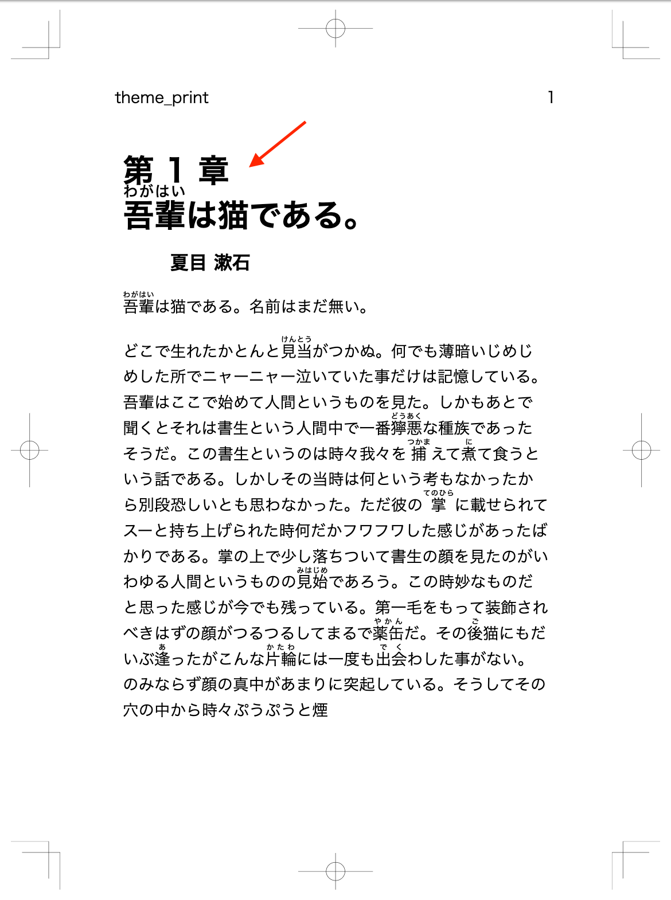
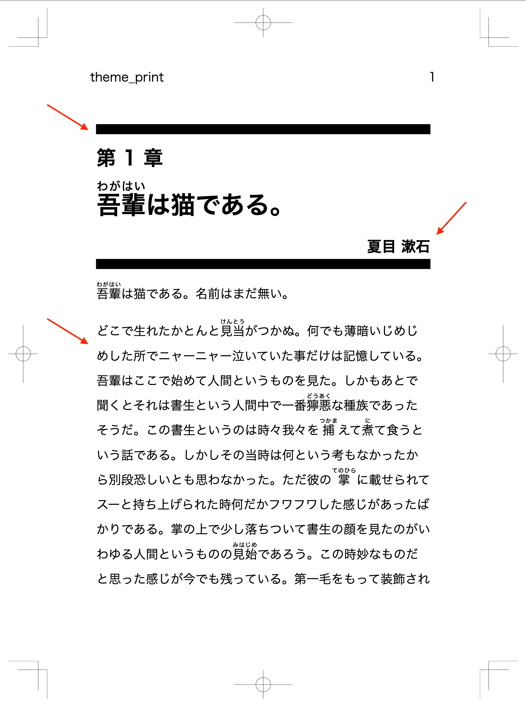
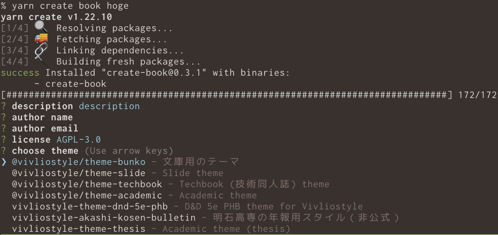

# Vivliostyle Theme のつくりかた

<div class="doc-author">
やましー
</div>

本稿は、Vivliostyle Theme を自作して配布する方法について書かれたものです。内容は[Vivliostyle ユーザーと開発者の集い 2021春](https://vivliostyle.connpass.com/event/208401/)で話したものです。

## はじめに
こんにちは、[やましー](https://twitter.com/yamasy1549)といいます。Vivliostyle ユーザ歴はもう 4 年近くなります。

最初の同人誌[『Vivliostyle で本を作ろう Vol.1』](https://vivliostyle.github.io/vivliostyle_doc/ja/vivliostyle-user-group-vol1/) では、『CSS 組版やってみた！』という題で Vivliostyle を使って同人誌や卒論を書いた際の tips を紹介しています。前回の同人誌[『Vivliostyle で本を作ろう Vol.4』](https://vivliostyle.github.io/vivliostyle_doc/ja/vivliostyle-user-group-vol4/) では『@vivliostyle/theme-academic でレポート書いてみた！』という題で記事を書いています。本稿では、Vivliostyle を使って出版物を作る際に必要になる Vivliostyle Theme を自作する方法を紹介します。

## Vivliostyle Theme とは
Vivliostyle Theme は、Vivliostyle で出版物を作る際に使うスタイルテーマです。Theme の実体は、CSS ファイルと package.json とサンプル原稿です。

Vivliostyle Foundation では、汎用的で多くの人に使ってもらえそうなスタイルを公式 Theme として公開しています。それ以外の個人や組織が公開したものを便宜上非公式 Theme と呼びますが、公式・非公式の違いは管理者以外にはありません。本稿執筆現在、公式 Theme として次の 4 つの Theme といくつかの非公式 Theme が公開されています。
- theme-bunko：A5 サイズの縦書きテーマ
- theme-slide：スライド資料用テーマ
- theme-techbook：印刷用に小口・ノドの余白を調整した、B5 サイズの横書きテーマ
- theme-academic：A4 サイズの横書きレポート用テーマ

## Theme を作ってみよう
それではオリジナルの Theme を作ってみましょう。今回作るのは、複数人の書き手による小説合同誌のための Theme です。かんたんな条件は以下のとおりです。

- 1 人が 1 章分＝1 つの原稿ファイル（.md）を担当
- 全体を通したページ番号、章番号がほしい
- 目次がほしい
- 見た目は統一するが、書き手によってテーマカラーを変えたい

CSS やサンプル原稿など具体的な部分は Theme ごとに変わりますが、作成手順はどの Theme も同じです。なお、完成品は [yamasy1549/vivliostyle-theme-my-doujin](https://github.com/yamasy1549/vivliostyle-theme-my-doujin) にあります。

### バージョン情報
- create-vivliostyle-theme: 0.3.1
- @vivliostyle/cli: 3.5.0
- @vivliostyle/vfm: v1.0.0-alpha.21
- @vivliostyle/viewer: 2.8.0

### ① 雛形から作ります
[create-vivliostyle-theme](https://vivliostyle.github.io/themes/packages/create-vivliostyle-theme/) は Theme を作るのに便利な雛形を提供しています。これを使って、npm または yarn で Theme の原型を作成します。本稿では yarn を使います。

```
$ yarn create vivliostyle-theme my-doujin
? description すごい合同誌のTheme
? author name わたし
? author email watashi@example.com
? license AGPL-3.0
? choose category novel

Success! Created vivliostyle-theme-my-doujin.

1. cd vivliostyle-theme-my-doujin
2. edit scss/*.scss
3. publish to npm ($ npm publish)

✨  Done in 46.57s.
```

これが Theme の原型です。Theme の作り手が編集するファイルには🖋マークをつけて示しています。

```
$ cd vivliostyle-theme-my-doujin
$ tree . -I node_modules
.
├── LICENSE
├── README.md
├── example                  サンプル原稿
│   ├── default.html
│   └── default.md           🖋Markdownを書く
├── package.json             🖋Themeの情報を書く
├── scss                     デフォルトで3つのスタイルファイル
│   ├── theme_common.scss    🖋 Themeの共通部分
│   ├── theme_print.scss     🖋 出版物 (PDF) 印刷用スタイル
│   └── theme_screen.scss    🖋 出版物 (HTML) 閲覧用スタイル
├── vivliostyle.config.js    🖋 プレビュー用設定ファイル
└── yarn.lock
```

example/ にはその Theme の適用例となるサンプル原稿を置きます。サンプル原稿は [Create Book](https://github.com/vivliostyle/create-book) を使って出版物を作る際、デフォルトの原稿として採用されます。

scss/ にはスタイルを置きます。Vivliostyle Theme では SCSS を推奨しています。デフォルトで 3 つの SCSS ファイルが作成されており、それぞれの役割は以下のとおりです。もちろん、SCSS ファイルを増やしてもかまいません。
- theme_print.scss：PDF 形式の出版物を印刷するときに適用するスタイル。トンボのスタイルなどはここで定義するとよいでしょう。
- theme_screen.scss：HTML 形式の出版物を閲覧するときに適用するスタイル。コンテンツが画面幅いっぱいに表示されるのを防ぐために表示幅を制限したり、文字サイズを調整したりするとよいでしょう。
- theme_common.scss：theme_print.scss や theme_screen.scss で共通して使うスタイル。

### ② サンプル原稿を用意します

次にサンプル原稿を用意します。この Theme のコンセプトは複数人の書き手による小説合同誌なので、それらしいサンプルを用意してみましょう。原稿は [VFM](https://github.com/vivliostyle/vfm) を使って書くことができます。

```example/ch01.md
# {吾輩|わがはい}は猫である。
## 夏目 漱石
{吾輩|わがはい}は猫である。名前はまだ無い。...
```

```example/ch02.md
# 羅生門
## 芥川 龍之介
ある日の暮方の事である。一人の{下人|げにん}が...
```

サンプル原稿を追加したら vivliostyle.config.js の entry にこれらを登録して、スタイルを適用した原稿をリアルタイムでプレビューできるようにします。

```vivliostyle.config.js
module.exports = {
  language: 'ja',
  theme: 'theme_print.css',
  entry: [
    'example/ch01.md',
    'example/ch02.md',
  ],
}
```

### ③ yarn dev でプレビューします
それでは、今作ったサンプル原稿にスタイル (theme_print.scss) を適用したものをプレビューしてみましょう。デフォルトの theme_print.scss には、トンボや左上の theme_print という文字を表示するようなスタイルが定義されています。

```
$ yarn dev
```


### ④ ページ番号と章番号を表示します
次に、ページ番号と章番号を表示してみましょう。theme_common.scss に追記していってもよいのですが、わかりやすさのため、本稿では新しく _my_style.scss というファイルを作ってそこに書いていくことにします。

```scss/theme_{print,screen}.scss
/* ... */
@import "_my_style";
```

まずはページ番号です。全ページの中で一番最初のページで `p` カウンタをリセットし、各ページでインクリメントします。
```scss/_my_style.scss
@page :first { counter-reset: p; }
@page { counter-increment: p; }

/* 小口側、上にページ番号 */
@page :left {
  @top-left { content: counter(p); }
}
@page :right {
  @top-right { content: counter(p); }
}
```

次に章番号です。vivliostyle.config.js の entry に指定した各ファイルの一番最初のページで、`chapter` と `p` カウンタをインクリメントします。 `@page :first` と `@page :nth(1)` の違いに注意してください。
```scss/_my_style.scss
/* ... */

/* 章番号 */
@page :nth(1) {
  counter-increment: chapter p;
}

/* 章タイトル */
h1 {
  &::before {
    content: "第 " counter(chapter) " 章";
    display: block;
  }
}
```

すると、プレビューはこのようになります。オートリロードされない場合はもう一度 `yarn dev` をしてみてください。

{width="50%"}

せっかくなのでもっと本らしい見た目にしてみましょう。

```scss/_my_style.scss
/* ... */

/* 章タイトル */
h1 {
  border-top: 10pt solid black;
  &::before {
    content: "第 " counter(chapter) " 章";
    display: block;
    font-size: 80%;
    margin: 10pt auto;
  }
}

/* 著者名 */
h2 {
  text-align: right;
  border-bottom: 10pt solid black;
}

/* 全体 */
html {
  line-height: 2rem;
}
```

{width="50%"}

### ⑤ 目次を表示します
ここまででページ番号と章番号を表示できました。次は目次です。Vivliostyle には `<h1>` 見出しをもとに目次を自動生成する機能があるので、これを使います。vivliostyle.config.js に以下の記述を加えて再度 `yarn dev` します。すると、一番最初のページに目次が表示されるようになりました。

```vivliostyle.config.js
module.exports = {
  // ...
  entry: [
    { rel: 'contents', theme: 'theme_toc.css' },
    'example/ch01.md'
    'example/ch02.md'
  ],
  toc: true,
  tocTitle: "目次",
}
```

続いて scss/theme_toc.scss という目次専用のスタイルファイルを作ります。ひとまず theme_common.scss を import しておきます。

```scss/theme_toc.scss
@import "theme_common";
```

{width="50%"}

もうすこしシュッとした見た目にしてみましょう。まず、不要な部分を隠します。

```scss/theme_toc.scss
@import "theme_common";

/* いらないところを消す */
@page :left {
  @top-left { content: ""; }
}
@page :right {
  @top-right { content: ""; }
}
h1 { display: none; }
h2 { text-indent: 0; }

nav ol {
  padding: 0;
  list-style: none;
}
```
{width="50%"}

目次にも対応するページ番号と章番号を表示してみましょう。一気に本らしくなりましたね！　これはもう誰が見ても本です。

```scss/theme_toc.scss
/* ... */

nav ol {
  /* ... */
  li a {
    text-decoration: none;
    color: inherit;
    &::before {
      content: "第 " target-counter(attr(href url), chapter) " 章";
      margin-right: 1rem;
    }
    &::after {
      content: target-counter(attr(href url), p);
      float: right;
    }
  }
}
```

{width="50%"}

### ⑥ 原稿ごとのテーマカラーを設定します
せっかくなので、原稿ごと（今回はつまり、著者ごと）にテーマカラーを決めてみましょう。サンプル原稿を少し編集します。`---` で囲まれた [Frontmatter](https://vivliostyle.github.io/vfm/#/vfm#frontmatter) 部分に class を指定すると、body 要素にその名前の class を付与できます。これを使って、原稿ファイルごとに別々のスタイルを適用できます。便利ですね。

```example/ch01.md
---
class: natsume
---

# {吾輩|わがはい}は猫である。
...
```

```example/ch02.md
---
class: akutagawa
---

# 羅生門
...
```

```scss/_my_style.scss
/* ... */

body.natsume {
  h1, h2 {
    border-color: darkcyan;
  }
}

body.akutagawa {
  h1, h2 {
    border-color: sienna;
  }
}
```

{width="50%"}

### ⑦完成！
おつかれさまです！　これで Theme が完成しました。`yarn publish` して npm package として公開すると、Create Book で出版物を作る際にその Theme を選択できるようになります。




## おわりに
本稿では Vivliostyle Theme を作成する方法を紹介しました。公開された便利な Theme は、Create Book を通して他の人に使ってもらうことができます。ぜひ公開してみてください。

現時点では、文庫ライクな縦書きの本、スライド、技術同人誌、論文やレポートといった公式 Theme が公開されています。今後は欧文文庫本や 2 段組み小説同人誌の公式 Theme を作成・公開していく予定です。 ご期待ください。

GitHub へのリンク：https://github.com/vivliostyle/themes
